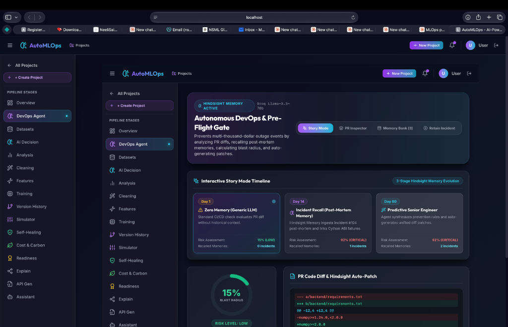
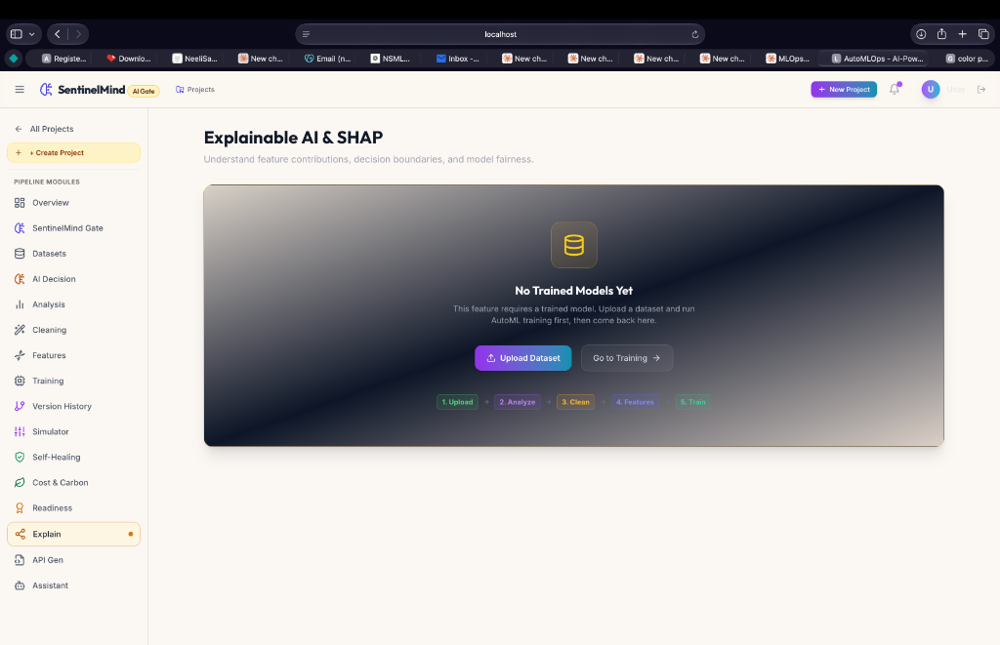

# Orvin AI — Autonomous Pre-Flight Gate & Enterprise AutoMLOps Platform

[](LICENSE)
[](https://python.org)
[](https://nextjs.org)
[](https://fastapi.tiangolo.com)
[](https://groq.com)

**Orvin AI** is a production-grade autonomous pre-flight CI/CD gate and machine learning operations platform. Powered by **Hindsight Episodic Memory** (Retain, Recall, Reflect) and **Groq Llama 3.3 70B**, Orvin prevents catastrophic production outages, ABI dependency mismatches, and GPU memory overcommit before code is merged.

---

## 🛡️ Why Orvin?

> **"Orvin"** originates from the Old English / Anglo-Saxon root *Ordwine* (compounded from *ord* = "spearpoint / forefront" and *wine* = "friend / protector"), translating to **"Friend of the Vanguard"** or **"Courageous Guardian"**.

In modern enterprise software and machine learning systems:
- **The Amnesia Problem**: CI/CD pipelines evaluate pull requests and configuration manifests in isolation. They have zero memory of yesterday's outages. Teams repeatedly suffer from the same recurring dependency collisions (e.g., NumPy 2.0 C-API ABI breakage in Cython extensions), GPU VRAM evictions, and staging-vs-production config drift.
- **The Orvin Guardian**: Just as a vanguard protector stands at the frontlines, **Orvin** guards the boundary between developer pull requests and production deployment. By giving CI/CD pipelines **episodic memory**, Orvin remembers every past incident post-mortem, semantic stack trace, and applied remedy.
- **Proactive Auto-Remediation**: When a high-risk change is detected, Orvin doesn't just block the PR—it autonomously synthesizes a compiler-safe, verified unified git `.patch` in seconds to unblock engineers safely.

<p align="center">
  
</p>

---

## ⚡ Core Capabilities

```
┌────────────────────────────────────────────────────────────────────────┐
│                              ORVIN AI                                  │
│              Autonomous Pre-Flight Gate & MLOps Engine                 │
└───────────────────────────────────┬────────────────────────────────────┘
                                    │
    ┌───────────────────────────────┼───────────────────────────────┐
    ▼                               ▼                               ▼
┌─────────────────────────┐ ┌─────────────────────────┐ ┌─────────────────────────┐
│  DevOps Pre-Flight Gate │ │   AutoML & Modeling     │ │  Governance & Sizing    │
├─────────────────────────┤ ├─────────────────────────┤ ├─────────────────────────┤
│ • PR Ingestion & Diffs  │ │ • 8+ Model Architectures│ │ • SHAP Explainability   │
│ • Hindsight Memory Recall│ │ • 5-Fold Cross-Valid.   │ │ • Cloud Hardware Sizing │
│ • Llama 3.3 Auto-Patch  │ │ • AI Feature Engineering│ │ • Carbon (CO2) Modeling │
│ • Blast Radius Scoring  │ │ • Automated Data Clean  │ │ • FastAPI / Docker Gen  │
└─────────────────────────┘ └─────────────────────────┘ └─────────────────────────┘
```

### 1. Autonomous Pre-Flight CI/CD Gate
- **Episodic Reflection (Retain, Recall, Reflect)**: Intercepts pull requests, manifests, and Dockerfiles to calculate blast-radius risk scores ($0\text{--}100\%$).
- **Instant Git Patch Generation**: Auto-synthesizes tested unified git patches using Groq Llama 3.3 70B.
- **Pre-Loaded Memory Banks**: Ready-to-demo incident memories including NumPy 2.0 ABI clashes, CUDA GPU OOM evictions, and Redis secret drifts.

<p align="center">
  
</p>

### 2. Multi-Model AutoML Studio
- Parallel training and benchmarking across 8+ algorithms (Random Forest, XGBoost, LightGBM, Gradient Boosting, Ridge, Logistic Regression, etc.).
- Automated 5-fold cross-validation, Bayesian hyperparameter optimization, and leaderboard ranking.

### 3. Dataset Intelligence & Progressive Lineage
- Automated statistical profiling, anomaly detection, missing value imputation, and outlier capping.
- Strict SHA-256 data fingerprinting and immutable lineage graphs with instant pipeline rollback.

### 4. Explainable AI (XAI) & Governance
- Global and local SHAP feature attributions, confusion matrices, and ROC/AUC curves.
- Spider radar readiness scoring and automated production deployment certificates.

### 5. Multi-Cloud Hardware & Carbon Footprint Sizing
- Hardware instance recommendations (CPU/GPU tiers) across Azure, AWS, and GCP.
- Real-time SLA latency estimations, monthly cost forecasting, and carbon footprint ($\text{kg CO}_2\text{e}$) sustainability modeling.

---

## 🚀 Quick Start

### Prerequisites
- Python 3.11+
- Node.js 18+ & npm

### 1. Backend Setup
```bash
cd backend
python -m venv .venv
source .venv/bin/activate  # On Windows: .venv\Scripts\activate
pip install -r requirements.txt
python -m uvicorn app.main:app --host 0.0.0.0 --port 8000
```
- **API Documentation (Swagger)**: `http://localhost:8000/docs`

### 2. Frontend Setup
```bash
cd frontend
npm install
npm run dev
```
- **Web Application**: `http://localhost:3000`
- **Pre-Flight Gate Simulator**: `http://localhost:3000/projects/proj-eqs1yte/devops-agent`

---

## 🧪 Architecture & Tech Stack

| Layer | Technology |
|---|---|
| **Frontend** | Next.js 14 (App Router), TypeScript, Tailwind CSS, Lucide Icons, Plotly.js |
| **Backend API** | FastAPI, Python 3.11, Pydantic v2, SQLAlchemy, Uvicorn |
| **Episodic Memory** | Hindsight Memory SDK (`devops_postmortems_bank`) |
| **LLM Reasoning Engine** | Groq API (`llama-3.3-70b-versatile`) |
| **Machine Learning** | Scikit-Learn, LightGBM, XGBoost, SHAP, NumPy, Pandas |
| **Design System** | Microsoft Light Cream Palette (`#FAF7F2` canvas, `#FFFDF9` surfaces, `#0F172A` slate typography) |

---

## 📄 License
Distributed under the MIT License. See `LICENSE` for more information.
